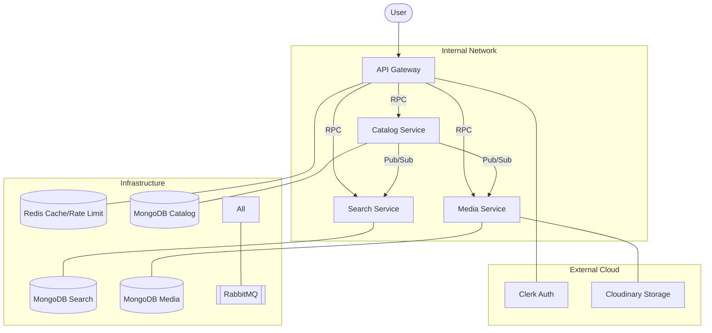

# ShopStack: E-Commerce Microservices

ShopStack is a high-performance, distributed e-commerce backend built with **NestJS**, designed to demonstrate modern microservices architecture, event-driven communication, and robust DevOps practices.

## 🏗 Architecture Overview

ShopStack follows a **Microservices Architecture** pattern, leveraging **RabbitMQ** for asynchronous, event-driven communication between services.



### Core Services

1.  **API Gateway**: The entry point for all client requests.
    *   **Features**: JWT Authentication (Clerk), Distributed Rate Limiting (Redis), RPC Routing.
2.  **Catalog Service**: The source of truth for product data.
    *   **Features**: CRUD operations, Product state management, Event publishing on product changes.
3.  **Search Service**: Optimized for product discovery.
    *   **Features**: Highly performant search queries, Data synchronization via RMQ events, Query caching (Redis).
4.  **Media Service**: Handles asset management.
    *   **Features**: Image upload processing, Cloudinary integration, Media metadata tracking.
5.  **RPC Library**: A shared internal library (`@app/rpc`) for standardized error handling, decorators, and RMQ communication patterns.

---

## 🚀 Tech Stack

*   **Framework**: [NestJS](https://nestjs.com/) (Node.js)
*   **Language**: TypeScript
*   **Communication**: RabbitMQ (Message Broker)
*   **Databases**: MongoDB (Mongoose), Redis (Caching & Rate Limiting)
*   **Authentication**: [Clerk](https://clerk.com/)
*   **Media Hosting**: [Cloudinary](https://cloudinary.com/)
*   **Containerization**: Docker & Docker Compose (Planned/In-Progress)

---

## ✨ Key Features

*   **Event-Driven Consistency**: Uses RabbitMQ to sync search indices and media associations when products are created or modified.
*   **Secure by Design**: Integrated Clerk middleware for robust identity management and role-based access control.
*   **Resilient Performance**: Distributed rate limiting and global query caching ensure the system scales gracefully.
*   **Shared RPC Layer**: Consistent error mapping between microservices and HTTP clients using a custom-built shared library.

---

## 🛠 Setup & Installation

### Prerequisites

*   Node.js (v20+)
*   Docker (for infra) or local instances of:
    *   RabbitMQ
    *   Redis
*   MongoDB Atlas or local MongoDB

### Environment Variables

Create a `.env` file in the root directory with the following variables:

```env
# Infrastructure
RABBITMQ_URL=amqp://localhost:5672
REDIS_URL=redis://localhost:6379

# Database URIs
MONGO_URI_USERS=...
MONGO_URI_CATALOG=...
MONGO_URI_SEARCH=...
MONGO_URI_MEDIA=...

# Auth (Clerk)
CLERK_SECRET_KEY=...
CLERK_PUBLISHABLE_KEY=...

# Media (Cloudinary)
CLOUDINARY_CLOUD_NAME=...
CLOUDINARY_API_KEY=...
CLOUDINARY_API_SECRET=...
```

### Installation

```bash
# Install dependencies
npm install

# Start infrastructure (if using Docker Compose)
docker-compose up -d rabbitmq redis

# Start services in development mode
npm run start:dev gateway
npm run start:dev catalog
npm run start:dev search
npm run start:dev media
```

---

## 📜 API Endpoints (Gateway)

| Method | Endpoint | Description | Auth |
| :--- | :--- | :--- | :--- |
| `POST` | `/products` | Create a new product (with image) | Admin |
| `GET` | `/products/list` | List paginated products | Public |
| `GET` | `/products/:id` | Get product details | Public |
| `PATCH` | `/products/:id` | Update product details | Admin |
| `DELETE` | `/products/:id` | Delete a product | Admin |
| `GET` | `/products/search` | Search products | Public |

---

## 🤝 Contributing

This project is a portfolio piece demonstrating distributed system patterns. Feel free to explore and provide feedback.
